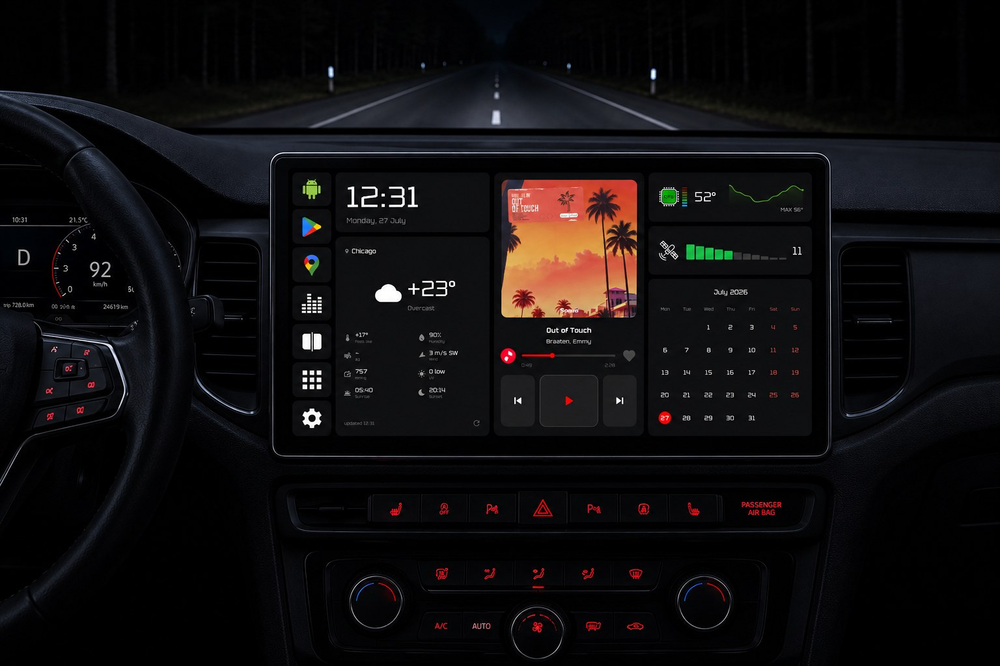
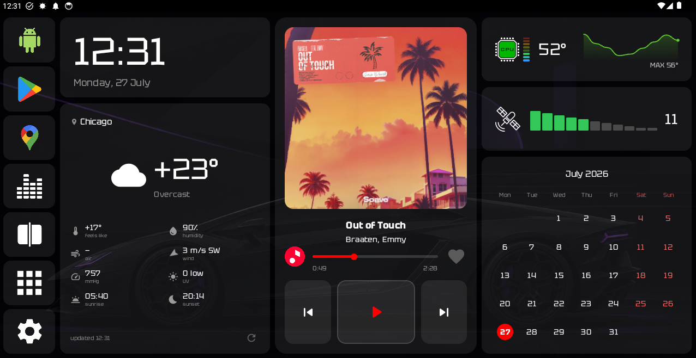
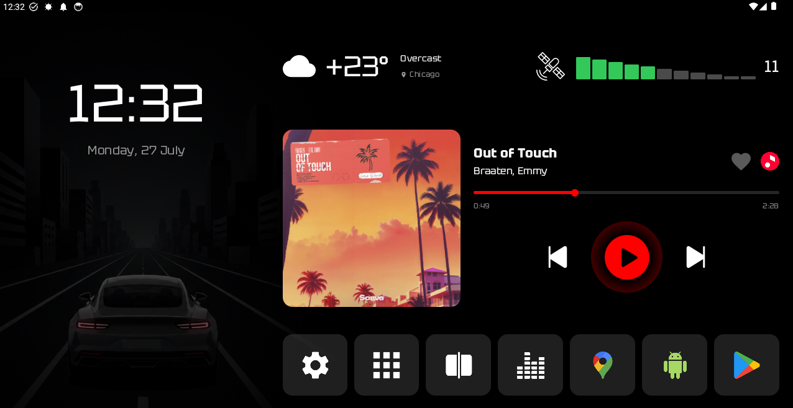
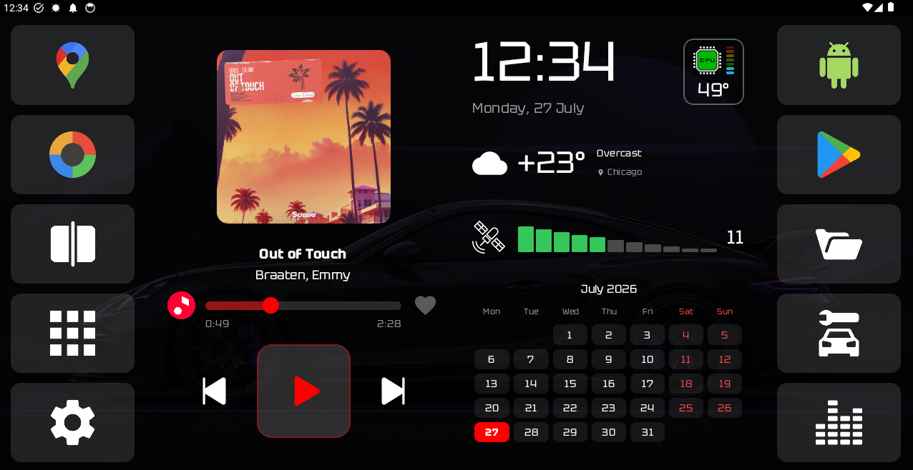
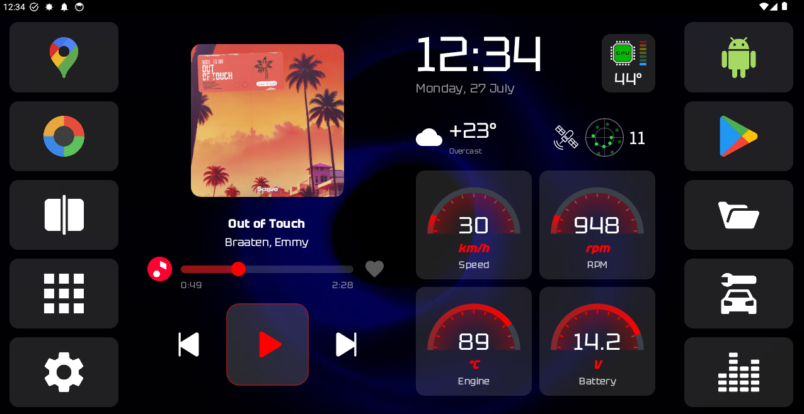
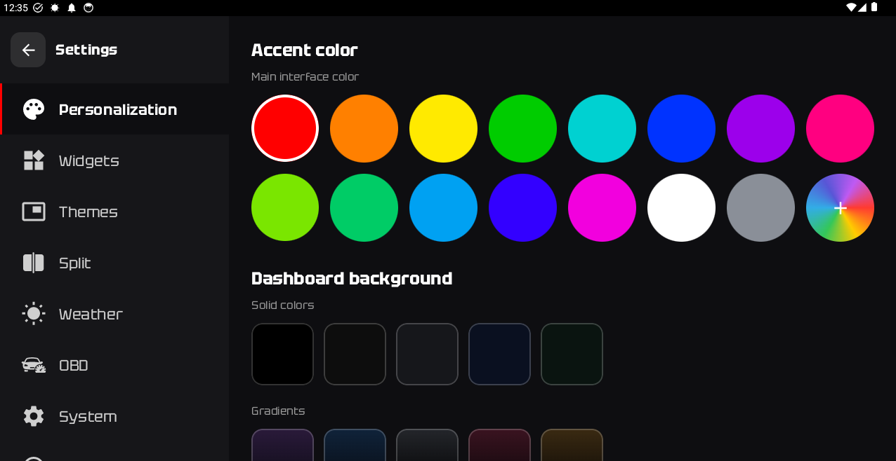
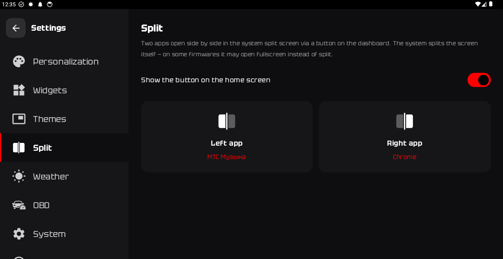
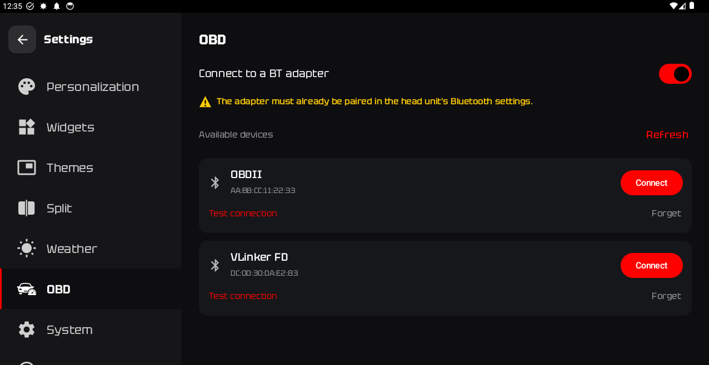
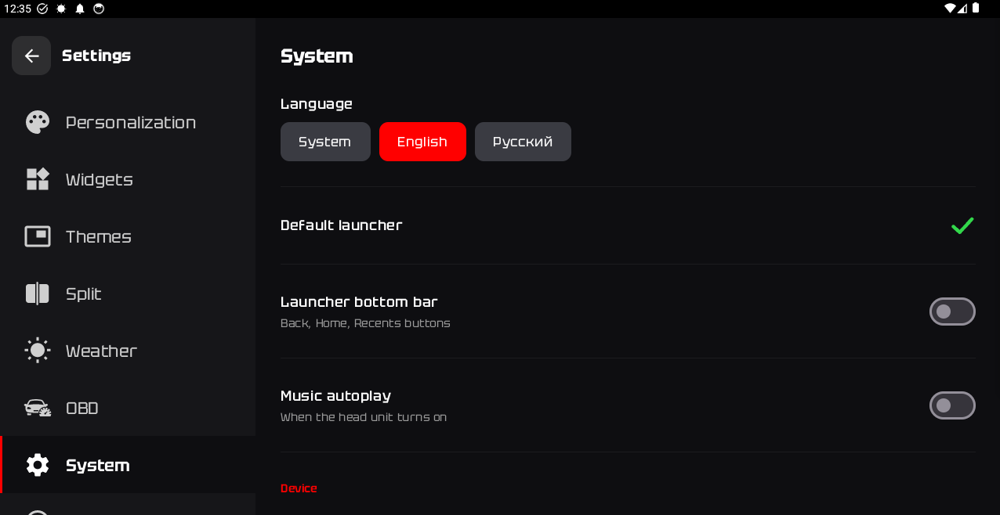
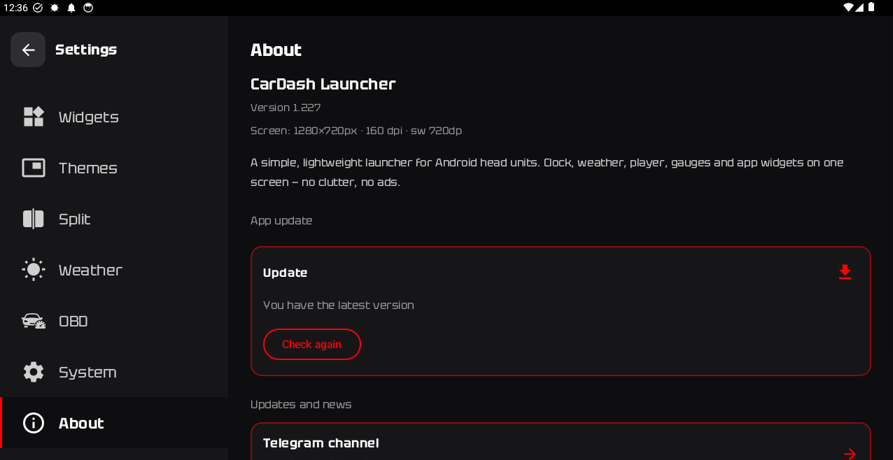

# CarDash Launcher

A dark dashboard in place of your head unit's stock screen. Music, weather, apps and car
telemetry, brought together in one screen and tuned to your car.

[Download the latest APK](../../releases/latest) · [Telegram channel](https://t.me/cardashlauncher) · [Website](https://mambatime.tech/cardash)

[Русская версия ниже](#по-русски)

## Themes

| | |
|:---:|:---:|
|  |  |
| Theme 1 | Theme 2 |
|  |  |
| Theme 3 | OBD |

There is also an OBD Color theme with separate gauges.

## Features

- Five dashboard themes: Theme 1, Theme 2, Theme 3, OBD and OBD Color.
- Clock, weather, calendar, GPS satellites and CPU temperature with a graph.
- Media control for any player, with a "favorite" button. Long track titles scroll.
- Swappable blocks: weather, CPU temperature, GPS and calendar can each be replaced with a widget
  from an installed app.
- Its own bottom bar (Back, Home, Recents) and quick-launch buttons.
- Split screen: a button opens two chosen apps side by side. The CarDash panel can take one of the
  halves.
- Vehicle data over OBD-II with an ELM327 Bluetooth adapter: RPM, speed, temperatures, voltage.
  Press and hold any gauge to choose which value it shows.
- Accent color from a palette or your own, and backgrounds: solid, gradient, wallpapers, your own
  image or video.
- English and Russian interface.
- Updates straight from the launcher.

## Settings

| | | |
|:---:|:---:|:---:|
|  |  |  |
| Accent and background | Split screen | OBD adapter |
|  |  | |
| Language and launcher | Updates | |

## Requirements

- Android 8.0 or newer.
- No Google Play Services needed. The launcher is lightweight and easy on weak head units.
- Built and tested on a UNISOC head unit with Android 13 and a wide landscape screen. Theme 1 also
  adapts to long screens such as 1920×720 and 1280×480: the player turns horizontal and the text
  gets larger. Other units and screen shapes may need adjustments. If something looks wrong on yours, please open an issue
  with a screenshot and the model of your head unit.

## Installation

1. Download `CarDash-Launcher.apk` from [Releases](../../releases/latest). The launcher is not on
   Google Play.
2. Allow installation from unknown sources.
3. On Android 13 and newer, open the app info and choose "Allow restricted settings". Without it,
   the system will not let you turn on notification access and accessibility for the launcher.
4. Set CarDash as the default launcher: in the launcher settings, open System, then Default launcher.

New versions install over the old one. Nothing needs to be removed first.

## Permissions

Every permission is optional and is used only for its own feature:

- notification access, to show and control music;
- location, for weather and GPS;
- Bluetooth, for the OBD adapter;
- accessibility, for the Recents button;
- storage, for your own backgrounds and music files.

Nothing is collected in the background.

## Feedback

Bug reports and ideas are welcome in [Issues](../../issues) or in the
[Telegram channel](https://t.me/cardashlauncher).

The source code is not published. The APK is signed with the author's key.

---

## По-русски

CarDash Launcher — тёмный дашборд вместо штатного экрана магнитолы. Музыка, погода, приложения и
телеметрия авто собраны на одном экране и настроены под вашу машину.

[Скачать последнюю версию](../../releases/latest) · [Telegram-канал](https://t.me/cardashlauncher) · [Сайт](https://mambatime.tech/cardash)

### Возможности

- Пять тем дашборда: Тема 1, Тема 2, Тема 3, OBD и OBD Color.
- Часы, погода, календарь, спутники GPS и температура процессора с графиком.
- Управление музыкой любого плеера, кнопка «В избранное». Длинные названия треков прокручиваются.
- Сменные блоки: погоду, температуру процессора, GPS и календарь можно заменить виджетом
  установленного приложения.
- Свой нижний бар (Назад, Домой, Недавние) и кнопки быстрого запуска.
- Сплит-экран: кнопка открывает два выбранных приложения рядом. Одной из половин может быть панель
  CarDash.
- Данные автомобиля по OBD-II через Bluetooth-адаптер ELM327: обороты, скорость, температуры,
  напряжение. Нажмите и удерживайте прибор, чтобы выбрать, что он показывает.
- Акцентный цвет из палитры или свой, фоны: цвет, градиент, обои, своя картинка или видео.
- Интерфейс на русском и английском.
- Работа при «белых списках» сети: дашборд остаётся полностью рабочим при ограниченном доступе к
  мобильной сети.
- Обновление прямо из лаунчера.

### Требования

- Android 8.0 и новее.
- Google Play Services не нужны. Лаунчер лёгкий и не грузит слабые магнитолы.
- Сделан и проверен на магнитоле UNISOC с Android 13 и широким горизонтальным экраном. Тема 1
  подстраивается и под длинные экраны вроде 1920×720 и 1280×480: плеер становится горизонтальным,
  текст — крупнее. На других магнитолах и экранах другой формы может понадобиться доработка. Если у вас что-то выглядит не
  так, создайте issue со скриншотом и моделью магнитолы.

### Установка

1. Скачайте `CarDash-Launcher.apk` в [Releases](../../releases/latest). В Google Play лаунчера нет.
2. Разрешите установку из неизвестных источников.
3. На Android 13 и новее откройте свойства приложения и выберите «Разрешить ограниченные
   настройки». Без этого система не даст включить доступ к уведомлениям и спецвозможности.
4. Назначьте CarDash лаунчером по умолчанию: в настройках лаунчера откройте «Система» →
   «Лаунчер по умолчанию».

Новая версия ставится поверх старой, удалять ничего не нужно.

### Разрешения

Все разрешения — по желанию, каждое только для своей функции:

- доступ к уведомлениям — для музыки;
- геолокация — для погоды и GPS;
- Bluetooth — для OBD-адаптера;
- спецвозможности — для кнопки «Недавние»;
- память — для своих фонов и музыки.

В фоне ничего не собирается.

### Обратная связь

Ошибки и идеи — в [Issues](../../issues) или в [Telegram-канале](https://t.me/cardashlauncher).

Исходный код не публикуется. APK подписан ключом автора.
